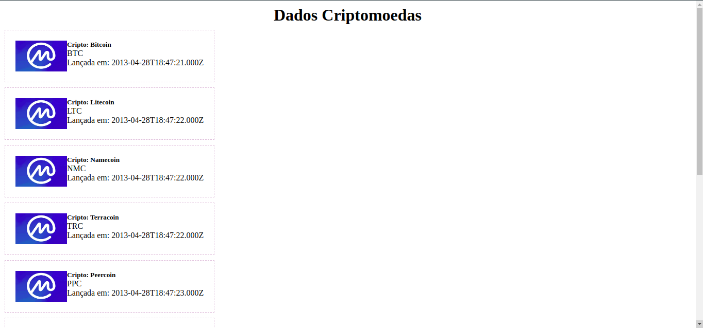

# Consumindo API de Bitcoin

## Conteúdo

- [Sobre](#sobre)
- [Imagens](#imagem)
- [Chave da API](#chave)

## Sobre 

Trata-se de projeto simples visando consumo de uma API fornecida pela [coinmarketcap.com](coinmarketcap.com), utilizando os dados da criptomoeda  Bitcoin e utilizando em um página web simples.

## Imagem 

Um exemplo da aplicação rodando é:

## Chave da API 

A chave da API é disponibilizada [coinmarketcap.com](coinmarketcap.com), inclusive com possibilidade de utilização gratuita. 
